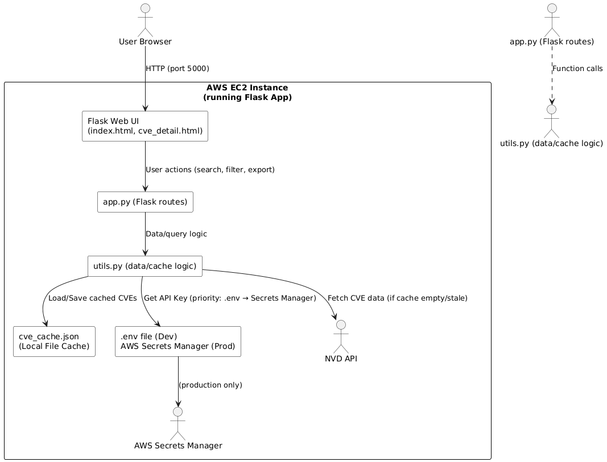
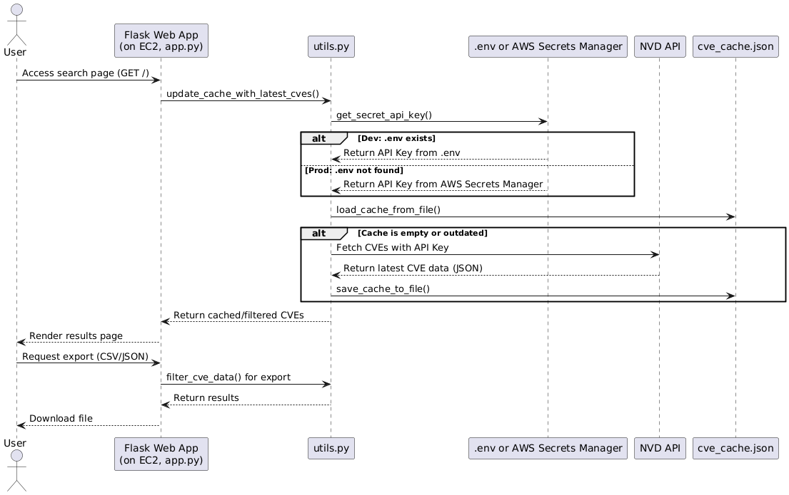

# Project: CVE Vulnerability Viewer - NVD_database_lookup
## Description: 
  A Python Flask application to fetch, display, and export CVE data from the National Vulnerability Database (NVD).
  Supports local development with .env or production on AWS EC2 using Secrets Manager.

## Prerequisites:
  - Python 3.7+
  - pip
  - NVD API Key (https://nvd.nist.gov/developers/request-an-api-key)
  - AWS Account (for production)
  - EC2 Instance (for production)
  - AWS Secrets Manager access (for production)
## Design
### Sequence diagram

### System Design

## Local Development:
    Clone the repository
      commands:
        - git clone https://github.com/eniac1546/NVD_database_lookup.git
        - cd NVD_database_lookup
    Create and activate a virtual environment
      commands:
        - python3 -m venv .venv
        - source venv/bin/activate           # On Windows: venv\Scripts\activate
    Install dependencies
      commands:
        - pip install -r requirements.txt
    Add your NVD API key to a .env file
      env_file:
        - NVD_API_KEY=your-nvd-api-key-here
    Run the application
      commands:
        - flask run
    note:
        Alternatively, run: python3 app.py
        Visit: http://localhost:5000/

### Production on EC2:

### Create a secret in AWS Secrets Manager
    aws_secrets_manager:
        name: nvd_api_key_secret
        key: NVD_API_KEY
        value: your-nvd-api-key-here
        region: AWS-region
    Attach IAM role to EC2 instance
      iam_role:
        permissions:
          - Effect: Allow
            Action: secretsmanager:GetSecretValue
            Resource: "*"
    SSH into EC2 instance
      commands:
        - ssh -i /path/to/your-key.pem ubuntu@<your-ec2-public-ip>
    Update and install dependencies
      commands:
        - sudo apt update
        - sudo apt install python3-pip python3-venv tmux -y
    Clone project and set up environment
      commands:
        - git clone https://github.com/eniac1546/NVD_database_lookup.git
        - cd NVD_database_lookup
        - python3 -m venv venv
        - source venv/bin/activate
        - pip install -r requirements.txt
        - rm -f .env   # Remove .env to force AWS Secrets Manager usage
    Run Flask app in tmux session in-case of session disconnect
      commands:
        - tmux new -s flaskapp
        - source venv/bin/activate
        - export FLASK_APP=app.py
        - flask run --host=0.0.0.0
    note: 
        Alternatively, run: python3 app.py
        Detach from tmux with: Ctrl+B, then D
        Visit: http://<ec_2_public_ip>:5000/
        No .env file needed in production if using AWS Secrets Manager. The app auto-detects and loads the key.

### Usage:
  - Search: Enter a CVE ID, keyword, or year in the search bar.
  - Filter: Use the severity dropdown to refine results.
  - Export: Download current page or all matching results as CSV or JSON.
  - View Details: Click any CVE ID for full details.

### api_key_security:
  local: API key is stored in .env.
  production: API key is securely retrieved from AWS Secrets Manager.
  autodetect: The app auto-detects the environment and loads the key from the appropriate source.

### exporting_data:
  - Export Current Page: Downloads only the visible results.
  - Export All Results: Downloads all results matching the current search/filter.
  - Single CVE Export: Export details for any specific CVE.

### Troubleshooting:
  api_rate_limit:
    - If you hit a rate limit, wait a minute and try again.
    - Ensure you are using your API key.
  aws_issues:
    - Ensure your EC2 IAM role has permissions for secretsmanager:GetSecretValue.
    - Make sure your secret's region matches your code/config.
  logs:
    - The app prints which source was used for the API key (env vs AWS).
